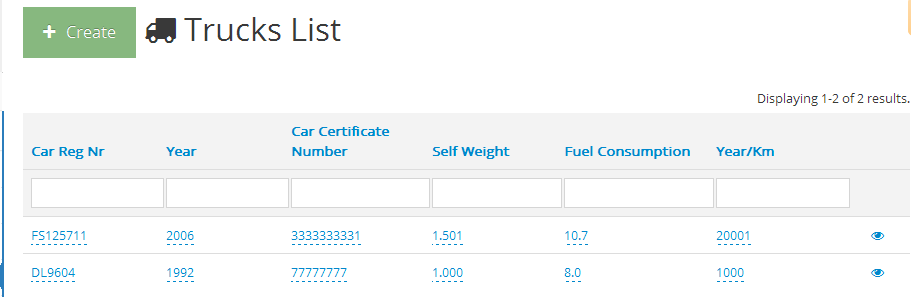
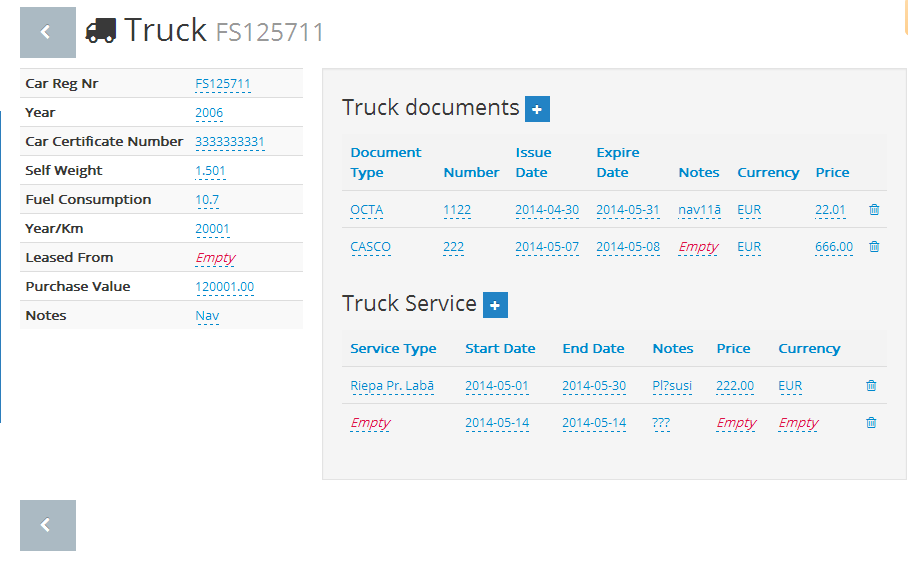

gii-template-collection
=======================

[Fork on github](https://github.com/schmunk42/gii-template-collection)

The gii-template-collection (gtc) contains templates for the Yii Framework Gii module.

For a Yii 2 port of this project, please visit [giiant](https://github.com/schmunk42/yii2-giiant).

**NOTE! Relation widgets moved to https://github.com/schmunk42/yii-relation**

Features
--------

* relation handling
* YiiBooster integration
* [giic](https://github.com/schmunk42/giic) prove
* customize inputs with code-providers, detect input-type by model and column
  * date and time pickers
  * checkboxes
  * relation widgets
  * editable grid columns
  * partial views
  * enum fields
* multi languages

### Templates

#### FullModule

#### FullModel
  
##### default 

Model Classes in two files `BaseModel`, `Model`

##### singlefile 

Standard Model Class `Model`

#### FullCrud 

##### slim

Bootstrap UI with relations

##### hybrid

Bootstrap UI with relations and grids

##### slim_editable

Screenshots:





##### legacy 

Original gtc CRUDs


Requirements
------------

* PHP 5.3 and `short_open_tags = On`


### Notes

* repo uses [git-flow](https://github.com/nvie/gitflow) naming conventions
* repo follows the guidelines of [semantic versioning](http://semver.org)

Installation
------------

Get it via composer:

    composer.phar require phundament/gii-template-collection

or

[Download latest release](https://github.com/schmunk42/gii-template-collection/releases)
To use it, simply extract the content of the archive into your application 
`extensions/` directory.


Setup
-----

1. Configure the templates in the `generatorPaths` section of the gii configuration inside your application configuration:

    ```
    'gii'=>array(
        'class'=>'system.gii.GiiModule',
        'password'=>'<your gii password>',
        'generatorPaths'=>array(
            'vendor.phundament.gii-template-collection',   
        ),
    ),
   ```
   After that, the new generators of gtc should be available in your Gii index page.

2. The last step is to add some gtc components to your import path so they can be found by the application:

   ```
	// autoloading model and component classes
	'import'=>array(
		// relation widget and save behavior
		'vendor.phundament.gii-template-collection.components.*', 
	),
    ```

3. For Debugging Information plz add the log under yours config console

    ````
    'components' => array(
        'log'      => array(
            'class'  => 'CLogRouter',
            'routes' => array(
                // file logging
                array(
                    'class'   => 'CFileLogRoute',
                    'logFile' => 'console.log',
                    'levels'  => 'error, warning, info, trace',
                    'enabled' => true,
                ),
            ),
        ),
    ),
    ````
Usage
-----

### Full Module

* open Gii
* select `FullModule`
* enter Module ID
* click `preview`
* click `generate`

### Full Model

* open Gii
* select `FullModel`
* enter model class
* click `preview`
* click `generate`

### Full CRUD

> Note: Generated templates require `clevertech/yiibooster >=1.1.1`
> Note: slim_editable require `vitalets/x-editable-yii dev`
* open Gii
* select `FullCrud`
* enter model class
* click `preview`
* click `generate`

#### AuthItems

Controller actions and UI buttons follow these `checkAccess` rules:

- Controller.*
- Controller.View
- Controller.Delete
- ...

From `0.13.0` on the a `Controller.SimpleUi` item was added by default, which hides UI elements, when this item is assigned to the current user.
> Note: An admin (superuser) always sees the full UI.

#### Template slim

Requirements: `https://github.com/clevertech/yiibooster`, `schmunk42/yii-relation`

#### Template slim editable

Requirements: 
- `https://github.com/clevertech/yiibooster`, 
- `schmunk42/yii-relation`, 
- `x-editable-yii` - `php composer.phar require dbrisinajumi/x-editable-yii dev-german-translations`

#### Template hybrid

An enhanced hybrid between the default/slim templates and the bootstrap crud generator.

Requires `x-editable-yii dev` and `echosen`.

Development
-----------

### Code Providers

The FullCrudCode is able to access providers from a provider-queue to render fields, labels, etc.
You can call a provider from your template with, eg.:

    $this->provider()->generateColumn($this->modelClass, $column)
    
FullCrudCode will walk the provider queue until it finds a provider which has the requested method AND which returns **not `null`**. This is on of the major differences compared to a behavior.

#### Example

Render a populated dropdown, if the model contains and `optsColumnName()` method.

    public function generateActiveField($model, $column)
    {
        $func = "opts".str_replace("_","",$column->name);
        if (method_exists($model, $func)) {
            return "echo \$form->dropDownList(\$model,'{$column->name}',{$model}::{$func}());";
        }
    }


### Coding Standards

GTC is using *`<?=""?>` Bobsled Coding Style*.

* Write PHP code to be generated wrapped in short-open-echo tags and **double quotes** 

```
<?=
"<?php 
    ...code... 
?>"
?>
```

* Use *bobsled* only for generating PHP code (in the gtc **templates**), DO NOT use short open tags in outputted code (yet)
* Use brackets `{}` to insert variables for generated code
* Use a `provider` to generate fields, labels, relations and columns.
* Follow [guidelines for-good schema design](http://www.yiiframework.com/wiki/227/guidelines-for-good-schema-design/) from the Yii Wiki
* Use a `UNIQUE` index over both of your foreign keys in your `MANY_MANY` tables


#### Examples

*tbd*

#### Known Problems and Limitations

* gtc does not support composite primary keys

Resources
---------

### Links

* [Yii Framework Extension Page](http://www.yiiframework.com/extension/gii-template-collection)
* [GitHub Project Page](https://github.com/schmunk42/gii-template-collection)
* [Phundament](http://phundament.com) Package


History
-------

This project has been originally created by [thyseus](http://www.yiiframework.com/user/1134/) back in 2010.

To quote from the original project page:

> Please enjoy this extension and let us collect as many Templates as possible for other people to enjoy. (haml, smarty, dwoo, twig, ...)

* [Project page up to version 0.6](http://code.google.com/p/gii-template-collection/)

In 2011 [schmunk](https://github.com/schmunk42) create the currently active fork of the project from revision 186 of the Google Code repository.

While there has been much, much, much, … code added over the time. At the end of July 2013 gtc was completely refurbished.


Contributors
------------

* Alban Jubert <alban.jubert@trinidev.fr>
* Anne Datema
* **Fredrik Wollsén <fredrik@neam.se>**
* Herbert Maschke <thyseus@gmail.com> (original creator)
* Igor Santos
* **Tobias Munk <schmunk@usrbin.de>**
* Uldis Nelsons <uldisnelsons@gmail.com>
* leo@finalresort.org
* robregonm <rodrigo.coelho@gmail.com>
* sealtrip
* thyseus

Active maintainers are written in **bold**.


Contact
-------

Of course, any templates are appreciated and just leave a comment or mail: <schmunk@usrbin.de>, <fredrik@neam.se> or <thyseus@gmail.com>.
